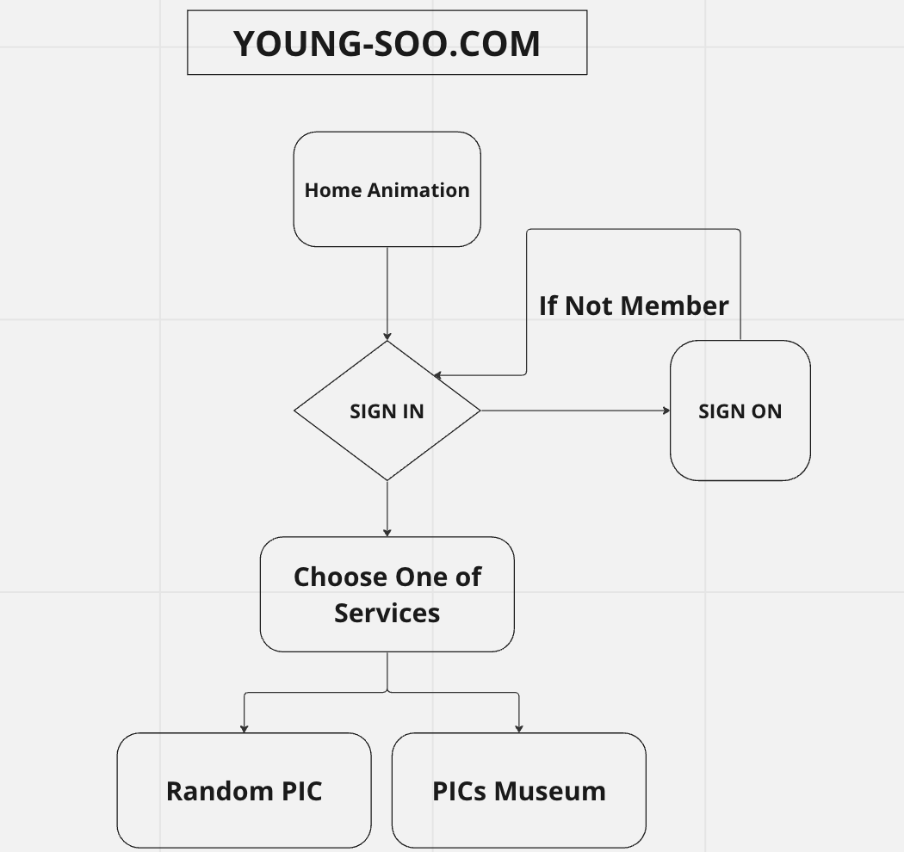
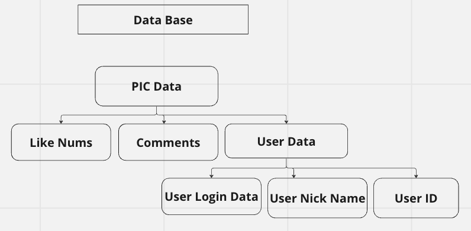

# 영수 게시판

## 구현 목표
> 1. 회원가입을 통한 유저 생성 및 로그인
> 2. 영수 사진첩 제작
> 3. 전체 사진 중,랜덤 확인 기능
> 4. 해당 사진 별 댓글 작성 / 수정 / 삭제 + 좋아요 기능

## 기능 순서도

## 데이터 베이스

## 개발 일지
> (230529) 영수 게시판 개발 시작!      
> (230610) 게시판 기능 순서도 & 데이터 베이스 작성

## 사용 기술
<link rel="stylesheet" href="https://cdn.jsdelivr.net/gh/devicons/devicon@v2.15.1/devicon.min.css">

Front-End : HTML / CSS / JavaScript  
Back-End : Python / Django
          
          

## Template Reference
> Template Name: PhotoFolio   
> Template URL: https://bootstrapmade.com/photofolio-bootstrap-photography-website-template/  
> Author: BootstrapMade.com   
> License: https://bootstrapmade.com/license/  
> [Page Link](https://bootstrapmade.com/bootstrap-photography-website-templates/)
